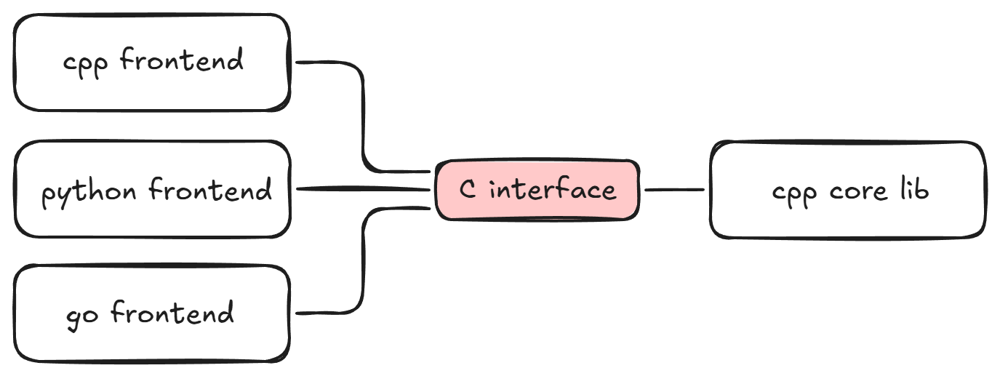
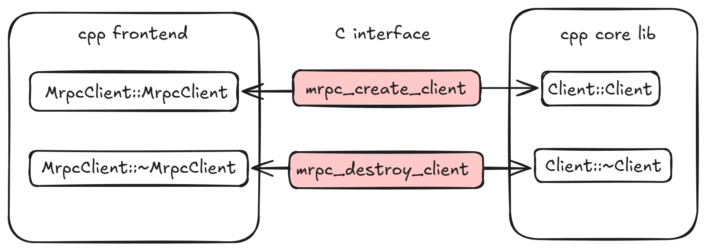
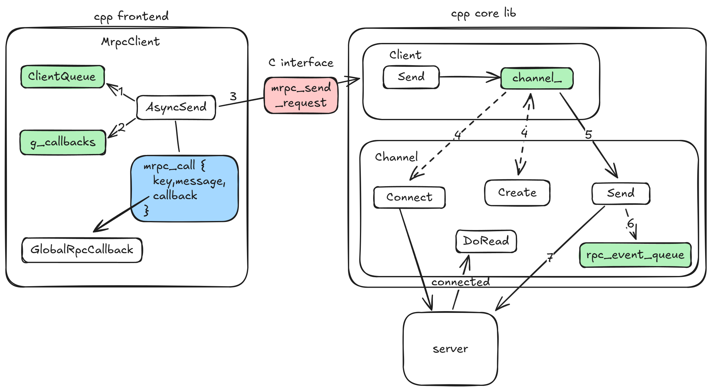
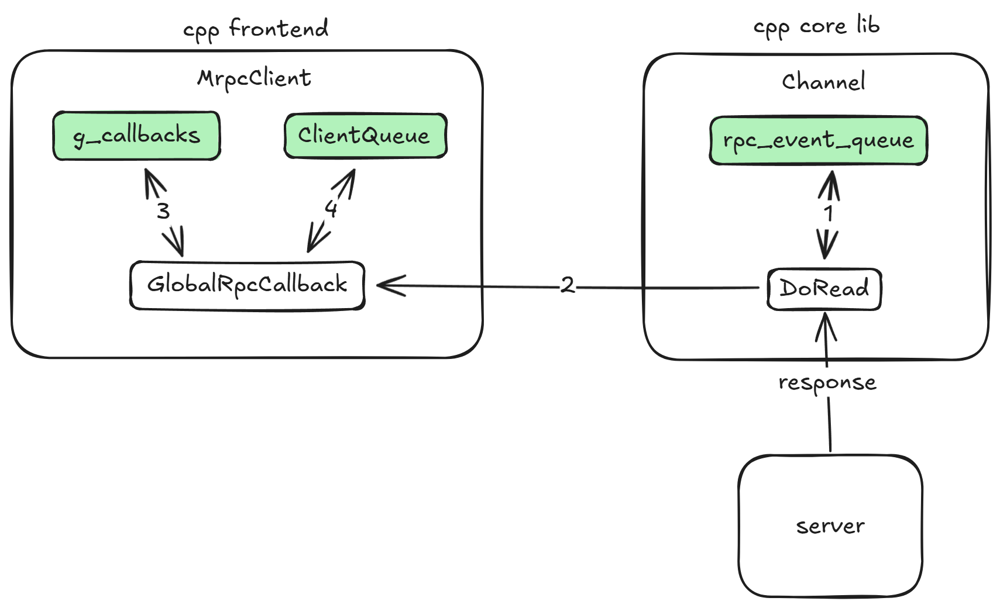
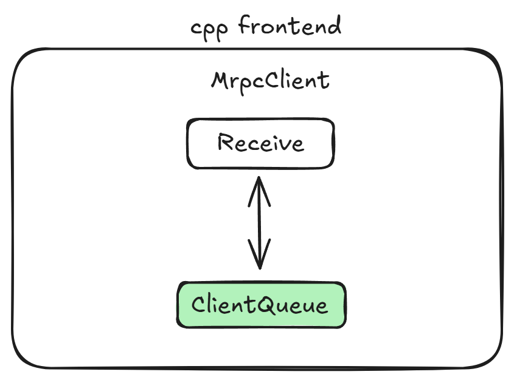

# MRPC


## Interface Definition Language

在当前版本的 MRC 框架中，我们采用 YAML 格式来描述 RPC 接口。以下为一个典型的接口定义示例：
```yaml
# example/helloworld.yaml
service:
  name: Greeter
  methods:
    SayHello:
      request:
        name: string
      response:
        message: string
```
现阶段框架尚未支持在请求和响应中使用自定义数据类型，下面是所有支持的数据类型：
- string
- int
- float
- bool

所有请求参数都应以扁平化的方式写入对应函数的 `request:` 字段中，`response:` 字段只能有一个返回参数。

## 客户端

MRPC 客户端的架构参考了 grpc 的实现（也是对前段时间 grpc 学习的一个小小总结）



如上图所示，MRPC 目前支持 cpp 、python 、go 的客户端，它们统一通过C接口调用了cpp实现的核心库，C接口在 `include/mrpc/mrpc.h` 中定义：
```C
typedef struct mrpc_call {
  const char *key;
  const char *message;
  response_handler handler;
} mrpc_call;

mrpc_client *mrpc_create_client(const char *addr);

void mrpc_destroy_client(mrpc_client *client);

mrpc_status mrpc_send_request(mrpc_client *client, mrpc_call *call)

int mrpc_get_unique_id(const char *func, char *buf);
```

下面以 cpp 前端为例来看看客户端的实现逻辑：



在 cpp 前端将所有客户端逻辑封装在 `MrpcClient` 中，在构造函数和析构函数中调用C接口，其中会创建核心库中 `Client` 对象，在其中封装了 RPC 请求的网络发送和接收逻辑。

在这里描述一下整个请求流程：

1. 在 `MrpcClient` 的构造函数中通过 `mrpc_create_client` 创建客户端，这将创建 `Client` 实例，返回一个 `mrpc_client` 句柄，后续的所有操作都需要使用此句柄，并且会初始化异步上下文

2. 接下来通过 `mrpc_get_unique_id` 获取此 RPC 请求的 ID，后续需要使用此 ID 来进行请求的发送和返回值接收

3. 使用 `mrpc_send_request` 来异步发送 RPC 请求，前端的 `Send`、`Async`、`Callback` 都是对此接口的封装，这里的需要传入 `mrpc_call`：
   - `key` 即为刚才获取的 ID
   - `message` 为需要发送的内容，在 MRPC 客户端中由不同语言的前端进行编解码操作
   - `handler` 为获取结果的回调函数，固定为下图中的 `GlobalRpcCallback`
  
   下面就来看看具体的发送逻辑：

   

   在不同语言前端中的 `Send`、`AsyncSend`、`Callback` 背后都是上图中 `AsyncSend` 的执行方式：
   1. 首先在 `ClientQueue` 中记录要进行的 RPC 请求，这是一个 map 用来存放每个请求的状态、结果以及可能的错误，每一项的 key 就是刚才获取的 ID
   2. 然后在 `g_callbacks` 中注册完成回调或者用户自定义的回调函数，后续会由 `GlobalRpcCallback` 来执行回调
   3. 然后构造一个 `mrpc_call`，通过 `mrpc_send_request` 将其传递到核心库，
   4. 在核心库中，`Client::Send` 首次执行时会通过 `Channel::Create` 创建实例，并调用 `Connect` 建立与服务端的连接，当连接成功后进入 `DoRead`，接收服务端消息
   5. 然后调用 `Channel::Send` 向服务端发送请求
   6. 在 `Channel::Send` 中在发送之前需要将已发送的请求记录到 `rpc_event_queue` 中。这里具体实现时由于与服务端建立连接是异步完成的，因此如果未建立连接则需要缓存待发送的请求，当成功建立连接后重新发送
   7. 在这时才真正进行发送

4. 当服务端执行 RPC 实现函数后，客户端会在 `DoRead` 中自动接收结果：

   

   其通过请求中的 key(ID) 在 `rpc_event_queue` 中查找记录，调用其 `callback`，及 `GlobalRpcCallback`，在其中从 `g_callbacks` 查找设置的回调函数，这可能是用户自定义的回调（通过 `CallbackSend`），或者是 `Send`、`AsyncSend` 中向 `ClientQueue` 暂存结果的回调

5. 然后如果是 `AsyncSend` 用户就可以通过 `Receive`，或 `Send` 中自动 `Receive` 来接收结果：

   

   其实就是查找的 `ClientQueue`。对于 `CallbackSend` 来说其回调函数在 `GlobalRpcCallback` 中已经执行了，并传入了执行结果

6. 最后在 `MrpcClient` 的析构函数中通过 `mrpc_destroy_client` 关闭客户端