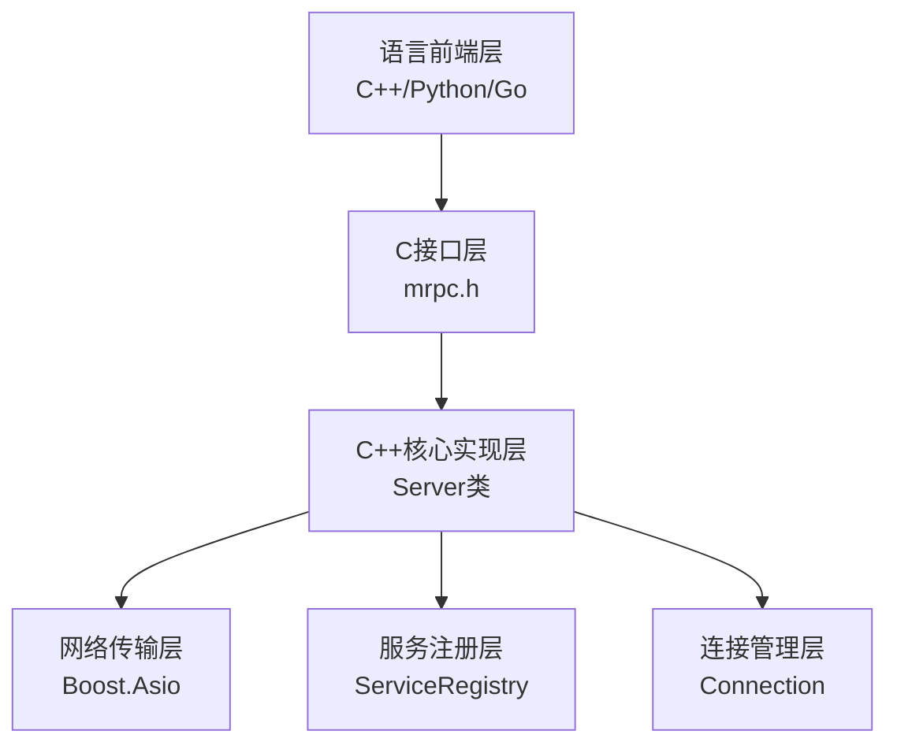
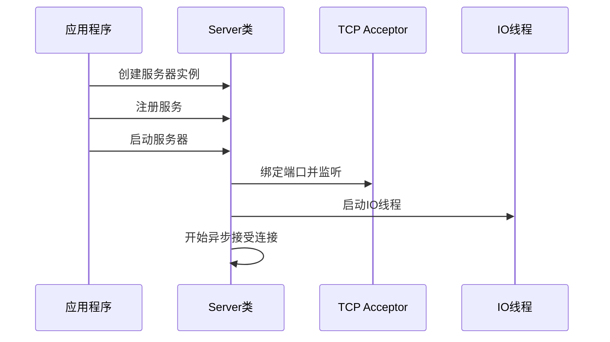
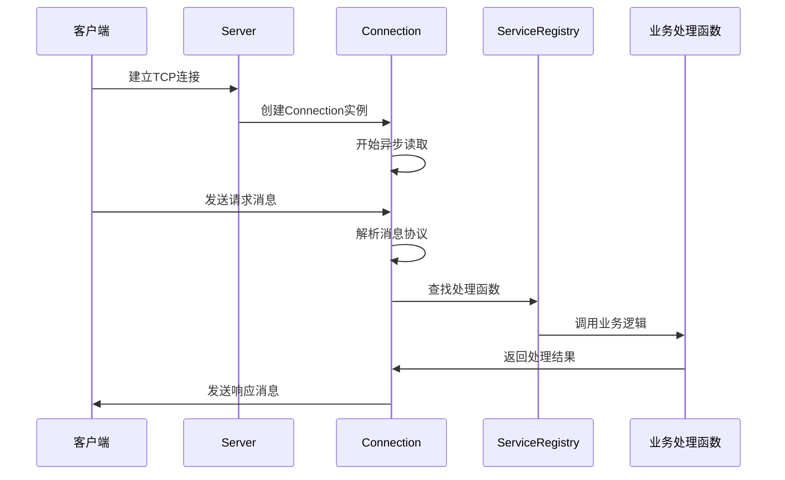

## 一、服务端整体架构概览

MRPC是一个多语言支持的RPC框架，采用了分层架构设计：



## 二、核心组件详细分析

### 1. 服务端核心类 `Server`

**位置**: `src/core/server/server.h`

```cpp
class Server : public CppImplOf<Server, mrpc_server> {
private:
  boost::asio::io_context io_;                    // 异步IO上下文
  boost::asio::executor_work_guard work_guard_;   // 工作守卫
  std::thread io_thread_;                         // IO线程
  ServerTarget target_;                           // 服务器地址目标
  tcp::acceptor acceptor_;                        // TCP接受器
  ServiceRegistry registry_;                      // 服务注册表
};
```


### 2. 服务注册表 `ServiceRegistry`

**位置**: `src/core/server/connection.h`

```cpp
class ServiceRegistry {
private:
  std::unordered_map<std::string, request_handler> handlers_;
public:
  void RegisterService(const std::string& service_name, 
                      const std::vector<std::string>& methods,
                      const std::vector<request_handler>& handlers);
  request_handler GetHandler(const std::string& method) const;
};
```

### 3. 连接管理 `Connection`

**位置**: `src/core/server/connection.h` 和 `connection.cc`

```cpp
class Connection : public std::enable_shared_from_this<Connection> {
private:
  tcp::socket socket_;                // TCP套接字
  ServiceRegistry* registry_;         // 服务注册表引用
  boost::asio::streambuf data_;       // 数据缓冲区
};
```


## 三、消息协议格式

MRPC使用自定义的文本协议：

```
消息格式: KEY#-#MESSAGE#MRPC#
```

**协议组成**：
- `CALL_DELIMITER = "#MRPC#"` - 消息结束标识
- `KEY_DELIMITER = "#-#"` - 键值分隔符
- `KEY`: 请求唯一标识（包含方法名和ID）
- `MESSAGE`: JSON格式的请求/响应数据

**解析逻辑**：
```cpp
auto [key, method, request, status] = ParseMessage(buffer_content);
// key: "func-id-123" 格式
// method: 从key中提取方法名 "/ServiceName/MethodName"
// request: JSON格式的请求数据
```

## 四、请求处理流程

### 1. 服务器启动流程



### 2. 连接建立和请求处理



## 五、多语言绑定架构

### 1. C接口层设计

**位置**: `include/mrpc/mrpc.h`

```c
// 服务端核心API
typedef void (*request_handler)(const char *key, const char *request, 
                               const char **response, mrpc_status *status);

typedef struct mrpc_service {
  const char *name;           // 服务名
  const char **methods;       // 方法名数组
  request_handler *handlers;  // 处理函数数组
  int method_count;          // 方法数量
} mrpc_service;

MRPC_API mrpc_server *mrpc_create_server(const char *addr);
MRPC_API mrpc_status mrpc_register_service(mrpc_server *server, mrpc_service *service);
MRPC_API mrpc_status mrpc_start_server(mrpc_server *server);
```

### 2. C++语言绑定

**设计模式**: 面向对象封装

```cpp
class MrpcServer {
  Status RegisterService(std::shared_ptr<ServiceBase> service);
  Status Start();
  void Wait();
};

class ServiceBase {
  virtual std::string GetServiceName() const = 0;
  virtual std::vector<std::string> GetMethodNames() const = 0;
  virtual std::vector<request_handler> GetHandlers() const = 0;
};
```

### 3. 代码生成机制

基于YAML接口定义文件自动生成：

**输入**: `helloworld.yaml`
```yaml
service:
  name: Greeter
  methods:
    SayHello:
      request:
        name: string
      response:
        message: string
```

**输出**: 
- 请求/响应数据类
- 客户端Stub类
- 服务端Service基类


## 六、架构优势

MRPC框架在保持简洁性的同时提供了良好的性能和扩展性。

```plaintext
graph TD
    A[语言前端层<br/>C++/Python/Go] --> B[C接口层<br/>mrpc.h]
    B --> C[C++核心实现层<br/>Server类]
    C --> D[网络传输层<br/>Boost.Asio]
    C --> E[服务注册层<br/>ServiceRegistry]
    C --> F[连接管理层<br/>Connection]
```

```cpp
class Server : public CppImplOf<Server, mrpc_server> {
private:
  boost::asio::io_context io_;                    // 异步IO上下文
  boost::asio::executor_work_guard work_guard_;   // 工作守卫
  std::thread io_thread_;                         // IO线程
  ServerTarget target_;                           // 服务器地址目标
  tcp::acceptor acceptor_;                        // TCP接受器
  ServiceRegistry registry_;                      // 服务注册表
};
```

```cpp
class ServiceRegistry {
private:
  std::unordered_map<std::string, request_handler> handlers_;
public:
  void RegisterService(const std::string& service_name, 
                      const std::vector<std::string>& methods,
                      const std::vector<request_handler>& handlers);
  request_handler GetHandler(const std::string& method) const;
};
```

```cpp
class Connection : public std::enable_shared_from_this<Connection> {
private:
  tcp::socket socket_;                // TCP套接字
  ServiceRegistry* registry_;         // 服务注册表引用
  boost::asio::streambuf data_;       // 数据缓冲区
};
```

```plaintext
消息格式: KEY#-#MESSAGE#MRPC#
```

```cpp
auto [key, method, request, status] = ParseMessage(buffer_content);
// key: "func-id-123" 格式
// method: 从key中提取方法名 "/ServiceName/MethodName"
// request: JSON格式的请求数据
```

```plaintext
sequenceDiagram
    participant App as 应用程序
    participant Server as Server类
    participant Acceptor as TCP Acceptor
    participant Thread as IO线程

    App->>Server: 创建服务器实例
    App->>Server: 注册服务
    App->>Server: 启动服务器
    Server->>Acceptor: 绑定端口并监听
    Server->>Thread: 启动IO线程
    Server->>Server: 开始异步接受连接
```

```plaintext
sequenceDiagram
    participant Client as 客户端
    participant Server as Server
    participant Conn as Connection
    participant Registry as ServiceRegistry
    participant Handler as 业务处理函数

    Client->>Server: 建立TCP连接
    Server->>Conn: 创建Connection实例
    Conn->>Conn: 开始异步读取
    Client->>Conn: 发送请求消息
    Conn->>Conn: 解析消息协议
    Conn->>Registry: 查找处理函数
    Registry->>Handler: 调用业务逻辑
    Handler->>Conn: 返回处理结果
    Conn->>Client: 发送响应消息
```

```c
// 服务端核心API
typedef void (*request_handler)(const char *key, const char *request, 
                               const char **response, mrpc_status *status);

typedef struct mrpc_service {
  const char *name;           // 服务名
  const char **methods;       // 方法名数组
  request_handler *handlers;  // 处理函数数组
  int method_count;          // 方法数量
} mrpc_service;

MRPC_API mrpc_server *mrpc_create_server(const char *addr);
MRPC_API mrpc_status mrpc_register_service(mrpc_server *server, mrpc_service *service);
MRPC_API mrpc_status mrpc_start_server(mrpc_server *server);
```

```cpp
class MrpcServer {
  Status RegisterService(std::shared_ptr<ServiceBase> service);
  Status Start();
  void Wait();
};

class ServiceBase {
  virtual std::string GetServiceName() const = 0;
  virtual std::vector<std::string> GetMethodNames() const = 0;
  virtual std::vector<request_handler> GetHandlers() const = 0;
};
```

```yaml
service:
  name: Greeter
  methods:
    SayHello:
      request:
        name: string
      response:
        message: string
```

