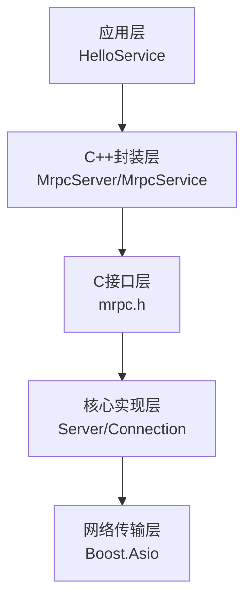
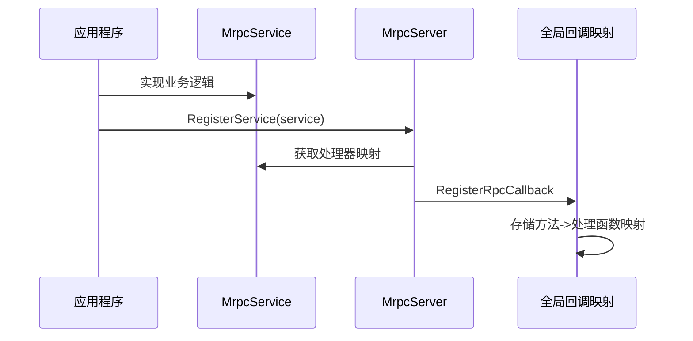
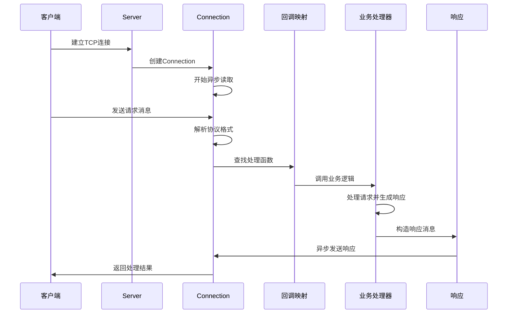

# MRPC服务端架构

## 一、整体架构设计

MRPC采用分层架构设计，从底层到高层分为以下几个层次，并与客户端保持对齐：



## 二、核心组件

### 1. 服务端核心类 `Server`

**位置**: `src/core/server/server.h`

`Server`类是整个服务端的核心，负责网络监听、连接管理和异步IO处理：

```cpp
class Server : public CppImplOf<Server, mrpc_server> {
private:
  boost::asio::io_context io_;                    
  boost::asio::executor_work_guard work_guard_;   
  std::thread io_thread_;                        
  ServerTarget target_;                           
  tcp::acceptor acceptor_;                        
  request_handler handler_;                       
  std::unordered_map<std::string, std::shared_ptr<Connection>> connections_;
  std::mutex connection_mutex_;                   
};
```

### 2. 连接管理 `Connection`

**位置**: `src/core/server/connection.h`

每个客户端连接对应一个`Connection`实例：

```cpp
class Connection : public std::enable_shared_from_this<Connection> {
private:
  tcp::socket socket_;                
  boost::asio::streambuf data_;      
  request_handler hander_;            
  std::function<void()> on_close_;    
};
```

### 3. C++高层封装 `MrpcServer`

**位置**: `include/mrpcpp/server.h`

提供面向对象的C++接口：

```cpp
class MrpcServer : public std::enable_shared_from_this<MrpcServer> {
private:
  mrpc_server *server_;                    
  std::vector<MrpcService *> services_;    
};
```

### 4. 服务抽象 `MrpcService`

支持泛型的服务基类：

```cpp
class MrpcService {
private:
  std::string service_name;
  std::map<std::string, std::shared_ptr<RpcMethodHandler>> methods_;

public:
  template <typename Request, typename Response, typename Func>
  void AddHandler(const std::string &method_name, Func &&func);
};
```

## 三、消息协议设计

### 协议格式

MRPC使用自定义的文本协议：

```
消息格式: KEY#-#MESSAGE#MRPC#
```

**协议组成**：
- `KEY`: 格式为`method-id-timestamp`，包含方法名和唯一标识
- `#-#`: 键值分隔符  
- `MESSAGE`: JSON格式的请求/响应数据
- `#MRPC#`: 消息结束标识

**解析逻辑**：
```cpp
auto [key, method, request, status] = ParseMessage(buffer_content);
// key: "func-id-123" 格式
// method: 从key中提取方法名 "/ServiceName/MethodName"
// request: JSON格式的请求数据
```

## 四、多语言绑定架构

### 1. C接口层设计

**位置**: `include/mrpc/mrpc.h`

```c
// 服务端核心API
typedef void (*request_handler)(const char *key, const char *request, 
                               const char **response, mrpc_status *status);

typedef struct mrpc_service {
  const char *name;           
  const char **methods;       
  request_handler *handlers;  
  int method_count;          
} mrpc_service;

MRPC_API mrpc_server *mrpc_create_server(const char *addr);
MRPC_API mrpc_status mrpc_register_service(mrpc_server *server, mrpc_service *service);
MRPC_API mrpc_status mrpc_start_server(mrpc_server *server);
```

### 2. C++语言绑定


```cpp
class MrpcServer {
  Status RegisterService(std::shared_ptr<ServiceBase> service);
  Status Start();
  void Wait();
};

class ServiceBase {
  virtual std::string GetServiceName() const = 0;
  virtual std::vector<std::string> GetMethodNames() const = 0;
  virtual std::vector<request_handler> GetHandlers() const = 0;
};
```

### 3. 代码生成机制

基于YAML接口定义文件自动生成：

**输入**: `helloworld.yaml`
```yaml
service:
  name: Greeter
  methods:
    SayHello:
      request:
        name: string
      response:
        message: string
```

**输出**: 
- 请求/响应数据类
- 客户端Stub类
- 服务端Service基类

## 五、请求处理流程

### 全局回调映射

服务方法通过全局映射表注册：

```cpp
// src/cpp/server.cc
std::map<std::string, Callback> g_callbacks;
std::mutex g_callback_mutex;

void RegisterRpcCallback(const std::string &key, Callback cb) {
  std::lock_guard<std::mutex> lock(g_callback_mutex);
  g_callbacks[key] = std::move(cb);
}
```

### 服务注册流程



### 完整处理链路

